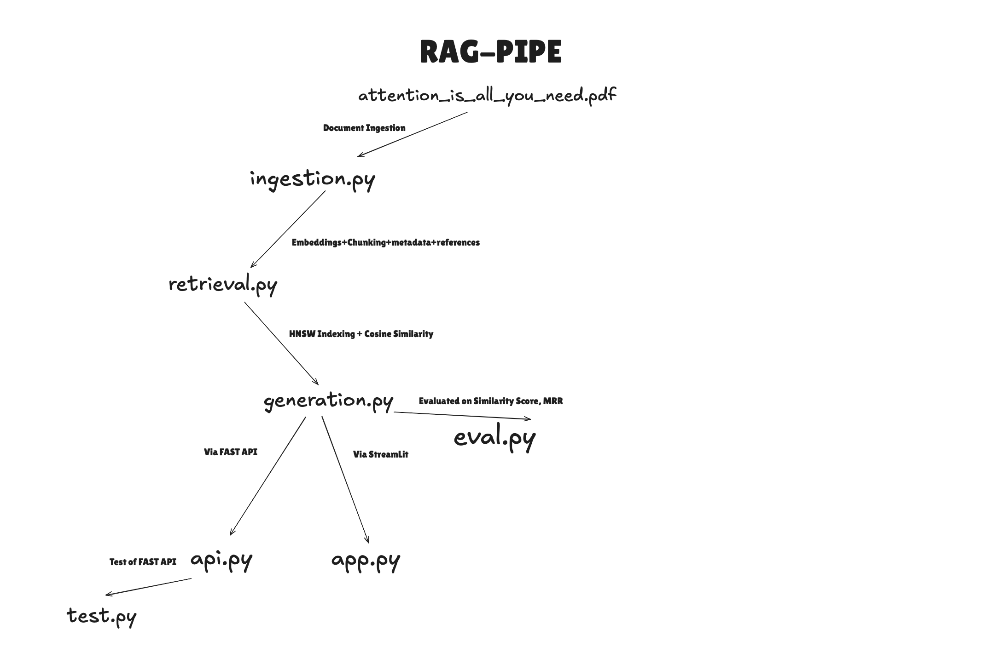

````md
# Q&A Retrieval System



A retrieval-based Q&A system that processes the **"Attention Is All You Need"** research paper, extracts relevant information, and generates responses using **FAISS**, **Ollama (Llama3.2)**, and **FastAPI**. The system retrieves the most relevant text chunks based on user queries and provides answers with in-text citations.

---

## Features

- **PDF Processing**: Extracts text, metadata, and citations from the research paper.
- **Vector Search**: Uses **FAISS HNSW** for efficient nearest-neighbor search.
- **Contextual Retrieval**: Retrieves the most relevant chunks for a query.
- **LLM Integration**: Uses **Llama3.2** via **Ollama API** for generating answers.
- **FastAPI Endpoint**: Provides a REST API for querying the system.
- **Streamlit UI**: A simple web interface for user interaction.
- **Evaluation**: Measures retrieval performance using similarity scores, exact match, and Mean Reciprocal Rank (MRR).

---

## Installation

### Prerequisites

Ensure you have the following installed:

- Python 3.8+
- [Ollama](https://ollama.ai) (for running Llama3.2 model)
- FAISS
- FastAPI & Uvicorn
- Streamlit
- Sentence-Transformers
- PyMuPDF

### Clone Repository

```bash
git clone https://github.com/udit-rawat/RAG-pipe.git
cd qa-retrieval-system
```

### Install Dependencies

```bash
pip install -r requirements.txt
```

---

## Usage

### 1. Preprocess and Index the Research Paper

Run the following script to:

- Download the paper
- Extract text and metadata
- Generate embeddings and build a **FAISS HNSW index**

```bash
python ingestion.py
```

---

### 2. Run the FastAPI Server

Start the API to handle queries.

```bash
python api.py
```

Test API with:

```bash
python test.py
```

---

### 3. Run the Streamlit UI

Launch the web interface.

```bash
streamlit run app.py
```

---

## Code Structure

```
qa-retrieval-system
 ├── ingestion.py          # Processes PDF, extracts text, builds FAISS index
 ├── retrieval.py          # Retrieves relevant chunks from the index
 ├── generation.py         # Generates the response using the local Ollama LLM
 ├── api.py                # FastAPI backend for query handling
 ├── app.py                # Streamlit UI for user interaction
 ├── evaluate.py           # Evaluates retrieval performance
 ├── requirements.txt      # Python dependencies
 ├── test.py               # For API test
 ├── README.md             # Project documentation
```

## Evaluation

Run retrieval performance evaluation using:

```bash
python eval.py
```

This script calculates:

- **Exact Match**
- **Semantic Similarity Score**
- **Mean Reciprocal Rank (MRR)**
````
